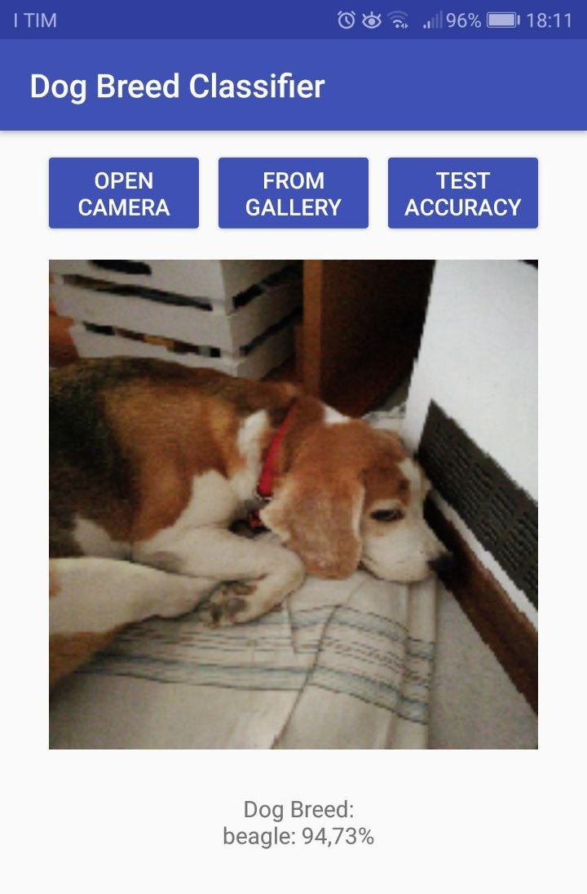

# Dog Breed Classification with Convolutional Neural Networks on Android app

Project developed for the "Statistical Methods for Machine Learning" master course.

This repository contains the implementation from scratch of a Convolutional Neural Network for image-based
Dog Breed classification. The trained neural network is also deployed on an Android application.

Details about the repository files:

- DogBreedClassifier: notebook in which the CNN model is builded and trained from scratch

- best\_model: "screenshot" of the running notebook in which the most accurate CNN model was trained

- AndroidApp: the Android project including a running application that relies on the most accurate CNN model

